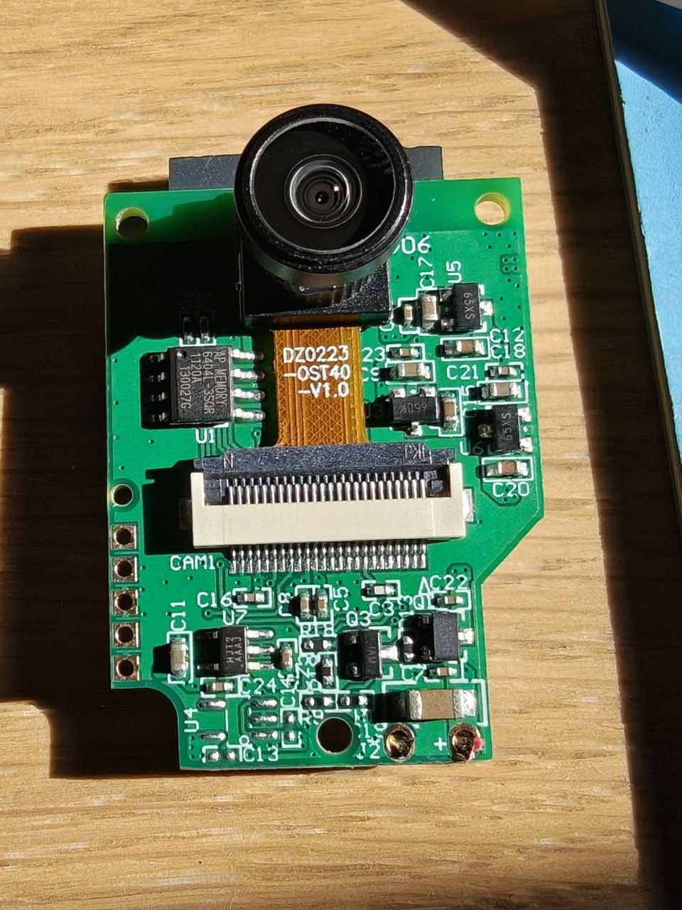
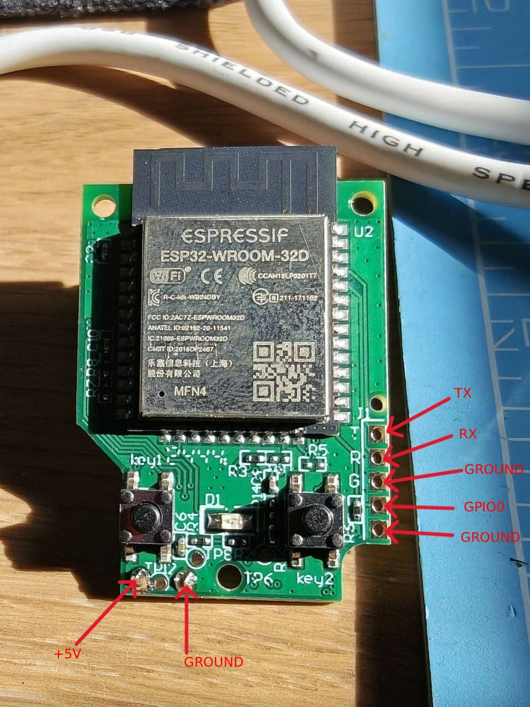

# WittSky

Replacement firmware for the **Ecowitt HP10 / HP10X** sky camera. Runs on the camera's own ESP32 hardware, keeps the same 4 MB flash layout, and gives you a self-contained web UI instead of the stock cloud-tethered one.

Current release: **WittSky_1.0.4**. See `firmware/main/version.h`.



---

## Disclaimer

**Use at your own risk.** This is a hobby project, not an Ecowitt product. Flashing WittSky voids any warranty from Ecowitt and may permanently disable your camera if something goes wrong (bad flash, wrong image, brownout during OTA, unlucky reset, cosmic ray). If your camera stops booting, stops joining Wi-Fi, or otherwise turns into a paperweight, that is on you.

Recovery is possible in almost every case, but it requires **opening the camera and soldering to the ESP32 module**. If you are not comfortable doing that, do not flash WittSky. See [Recovery — restoring stock firmware](#recovery--restoring-stock-firmware) below.

---

## What it does well

- **Runs entirely on the camera.** No cloud account is required. The full web UI (login, live stream, capture, network, upload settings, overlay, system, sky) is served from the ESP32 on port 80.
- **Live MJPEG stream** on port 81 and single-shot `/capture` on port 80.
- **Scheduled uploads** to Ecowitt.net or to any HTTP/HTTPS endpoint you choose (5 / 10 / 15 / 20 / 25 min intervals).
- **Weather overlay** on stills. Burns timestamp, wind, temperature, rain, and a compass rose into the JPEG from either a local Ecowitt gateway or the Ecowitt cloud API. The live stream stays clean.
- **Ecowitt account integration.** Log in with your Ecowitt account and register the camera from the web UI; uploads then show up under your account like the stock camera did.
- **Runtime themes.** Three looks — Dark, Station warm, Technical — switchable from the System page. Choice persists in NVS.
- **Time-zone-aware clock** with real sunrise / sunset from the saved location.
- **Watchdog with reboot cap.** If the camera or uploads fail repeatedly it reboots itself, but stops after N reboots in an M-minute window so it doesn't boot-loop forever.
- **OTA updates from the browser.** Either check a version-info URL (default: this repository's `ota.json`) or flash a `.bin` directly from your PC.
- **mDNS** at `http://camera.local` (hostname configurable).
- **WebSocket log stream** for debugging.

## What it barely does

- **Sky statistics.** Off by default. When you enable it, the firmware decodes each JPEG to a small buffer and computes cloud fraction, saturation, luma, sharpness, exposure, gain, and a relative "light index". It is genuinely useful for tracking daytime sky conditions, but it is **not calibrated**: the cloud-vs-blue threshold is a fixed R/B ratio, the light index is relative not lux, and cloud numbers are withheld outside daylight or when the sky mask lands on a roof. Treat the numbers as trends, not measurements. The detailed math is in the old README (`README.old.md`, kept locally, gitignored).

## What it does not do

- No SD card, no local image storage. Every capture is either streamed live or posted to a remote endpoint.
- No PTZ, no motion detection.
- No HTTPS server on the camera itself (only the OTA / upload clients speak TLS).

---

## Hardware

- ESP32-WROOM-32D, 4 MB flash, external PSRAM
- OV2640 camera sensor (parallel DVP)
- 2.4 GHz Wi-Fi only

Detailed pinout, boot sequence, and the reason for the 15 dBm PHY cap are in `README.old.md`. If you are just installing WittSky, you do not need to know that.

---

## Installation

There are two paths, in order of preference:

### Option A — OTA spoofing (no soldering)

**Recommended for the first install** if your camera still boots stock firmware and can join a Wi-Fi network.

You bring up a small local network on your PC that impersonates Ecowitt's OTA servers. The camera checks for a "new version", is told WittSky is available, and downloads it into the inactive OTA slot exactly the same way it would a stock update.

Full walkthrough: **[OTA_SPOOF/README.md](./OTA_SPOOF/README.md)**.

Point the spoof's `FW_PATH` at the release binary — either `firmware/build/WittSky_1.0.4.bin` after building locally, or the `WittSky_1.0.4.bin` attached to the [GitHub release](https://github.com/Damiasroca/WittSky/releases).

### Option B — Serial flash

Requires the camera to be open and a USB-UART adapter wired to the ESP32 module. See the pinout in the [Recovery](#recovery--restoring-stock-firmware) section — the pads are the same.

From an ESP-IDF 5.x exported shell, in `firmware/`:

```bash
idf.py set-target esp32
idf.py -p <PORT> flash monitor
```

Once WittSky is on the camera, later updates use the System page.

---

## First-time configuration

After WittSky is running:

1. **Connect.** Join the open Wi-Fi network `HP10-WIFIxxxx` (where `xxxx` is the last two bytes of the MAC), open `http://192.168.4.1/`, log in with any password (the first login sets no password).
2. **Network.** Scan and join your 2.4 GHz router. Once the page shows a station IP, `http://camera.local` also works.
3. **Capture.** Set latitude, longitude, and your IANA time zone. Wait for the date field to show a real clock — sunrise and sunset will fill in.
4. **Uploads.** Either register with Ecowitt.net and enable "Ecowitt.net", or set a "Custom URL" endpoint. Choose an interval.
5. **Camera.** Frame the shot, save. Reboot if you changed the resolution.
6. **System.** Set a login / AP password (this reboots the camera; the same password guards both the AP and login). Optionally pick a theme, adjust watchdog thresholds, enable the log stream.

**Upload now** on the Status page is the fastest way to prove the upload path before waiting for the first scheduled capture.

---

## Recovery — restoring stock firmware

If WittSky won't boot, won't join Wi-Fi, or the camera is otherwise unreachable, you can always restore the stock Ecowitt firmware over serial. The image is in [`STOCK_FIRMWARE/HP10_V1.1.1.bin`](./STOCK_FIRMWARE/HP10_V1.1.1.bin).

### 1. Open the camera

Take the camera apart to expose the ESP32-WROOM-32D module. The pads you need are on the right edge and bottom of the board:



The pads used for recovery are:

| Pad | Purpose |
| --- | --- |
| **TX** | Serial data, device → PC |
| **RX** | Serial data, PC → device |
| **GROUND** | Signal ground (either of the two labeled pads works) |
| **GPIO0** | Momentarily jumper to GROUND to enter download mode |
| **+5V** | Power. This is the only supply pad on the board |

### 2. Wire a USB-UART adapter

The adapter used here is the [DFRobot Rainbow Link](https://wiki.dfrobot.com/tel0190/). Its TTL port and 5 V output go to the pads below.

- Adapter **TX → RX** (on the board)
- Adapter **RX → TX** (on the board)
- Adapter **GND → GROUND**
- Adapter **5 V → +5V** (this is how the board is powered)

### 3. Put the ESP32 in download mode

The stock bootloader only enters "wait for esptool" mode when GPIO0 is low at reset:

1. Jumper **GPIO0 → GROUND** with a wire or tweezers.
2. Power the camera on (or press its reset button while the jumper is held).
3. Remove the jumper.

The chip is now waiting for a serial command on the UART.

### 4. Flash stock firmware

The stock image is an app-only image (~1.1 MB) that lives at OTA slot 0, offset `0x10000`:

```bash
python -m esptool --chip esp32 -p <PORT> -b 460800 write_flash 0x10000 STOCK_FIRMWARE/HP10_V1.1.1.bin
```

Or, if you have ESP-IDF exported:

```bash
esptool.py --chip esp32 -p <PORT> -b 460800 write_flash 0x10000 STOCK_FIRMWARE/HP10_V1.1.1.bin
```

Then power-cycle the camera (or reset without the GPIO0 jumper). It should come back up as a stock HP10 with its original `HP10-WIFI` access point.

If serial `write_flash` fails to detect the chip, the module is not in download mode — repeat step 3 with a slightly longer jumper time.

---

## Building from source

Requires **ESP-IDF 5.x** (tested with 5.5). From an exported IDF shell, in `firmware/`:

```bash
idf.py set-target esp32
idf.py build
```

Output is `firmware/build/hp10_bringup.bin` (renamed to `firmware/build/WittSky_<version>.bin` by a post-build step). The version string comes from `HP10_VERSION` in `firmware/main/version.h`.

---

## Repository layout

```
firmware/         ESP-IDF project (main app + embedded web UI)
firmware/web/     Web UI source (HTML / CSS / JS embedded into the app)
OTA_SPOOF/        PC-side scripts to install WittSky without opening the camera
STOCK_FIRMWARE/   Ecowitt HP10 V1.1.1 image for recovery
tools/            Overlay-asset regeneration script and preview overlay tool
ota.json          Manifest served to WittSky clients checking for updates
HP10.jpg          UART pinout photo for recovery
HP10_CAM.jpg      Front-side photo of the camera board
```
